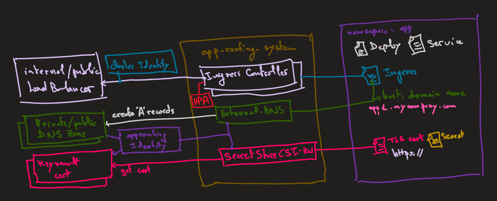

# AKS Web App Routing demystified

When you expose your AKS applications, you typically use ingress. With ingress, you will need to manage:

1) Private and public Ingress Controllers
2) DNS custom domain names
3) TLS certificates

You wish if just there were a managed service that make this task easy ?
Now that service exist. It is called Application Routing.
Here is how it works.



Disclaimer: This video is part of my Udemy course: https://www.udemy.com/course/learn-aks-network-security

```sh
az group create -n rg-aks-cluster -l swedencentral

az aks create -n aks-cluster -g rg-aks-cluster --network-plugin azure --network-plugin-mode overlay -k 1.29.2 --enable-app-routing

az aks show -n aks-cluster -g rg-aks-cluster --query ingressProfile
# {
#   "webAppRouting": {
#     "dnsZoneResourceIds": null,
#     "enabled": true,
#     "identity": {
#       "clientId": "c9616b19-7bc9-47eb-ab18-2604f18034ed",
#       "objectId": "42e3242e-653d-4e48-b85d-0a183420017a",
#       "resourceId": "/subscriptions/38977b70-47bf-4da5-a492-88712fce8725/resourcegroups/MC_rg-aks-cluster_aks-cluster_swedencentral/providers/Microsoft.ManagedIdentity/userAssignedIdentities/webapprouting-aks-cluster"
#     }
#   }
# }

az aks get-credentials -n aks-cluster -g rg-aks-cluster --overwrite-existing

kubectl get all -n app-routing-system
# NAME                         READY   STATUS    RESTARTS   AGE
# pod/nginx-75b695b88d-d7knp   1/1     Running   0          8m17s
# pod/nginx-75b695b88d-tn8c6   1/1     Running   0          8m32s

# NAME            TYPE           CLUSTER-IP   EXTERNAL-IP   PORT(S)                                      AGE
# service/nginx   LoadBalancer   10.0.10.4    4.225.23.86   80:30539/TCP,443:30249/TCP,10254:31107/TCP   8m32s

# NAME                    READY   UP-TO-DATE   AVAILABLE   AGE
# deployment.apps/nginx   2/2     2            2           8m32s

# NAME                               DESIRED   CURRENT   READY   AGE
# replicaset.apps/nginx-75b695b88d   2         2         2       8m32s

# NAME                                        REFERENCE          TARGETS   MINPODS   MAXPODS   REPLICAS   AGE
# horizontalpodautoscaler.autoscaling/nginx   Deployment/nginx   0%/80%    2         100       2          8m32s

kubectl get ingressclass
# NAME                                 CONTROLLER                                 PARAMETERS   AGE
# webapprouting.kubernetes.azure.com   webapprouting.kubernetes.azure.com/nginx   <none>       20m

kubectl get nginxingresscontroller
# NAME      INGRESSCLASS                         CONTROLLERNAMEPREFIX   AVAILABLE
# default   webapprouting.kubernetes.azure.com   nginx                  True

kubectl create namespace webapp

kubectl apply -f app.yaml -n webapp
# deployment.apps/aks-helloworld created
# service/aks-helloworld created
# ingress.networking.k8s.io/aks-helloworld created

kubectl get ingress -n webapp -w
# NAME             CLASS                                HOSTS   ADDRESS       PORTS   AGE
# aks-helloworld   webapprouting.kubernetes.azure.com   *       4.225.23.86   80      5m53s

kubectl apply -f nginx-public-controller.yaml

kubectl apply -f nginx-internal-controller.yaml

kubectl get nginxingresscontroller
# NAME             INGRESSCLASS                         CONTROLLERNAMEPREFIX   AVAILABLE
# default          webapprouting.kubernetes.azure.com   nginx                  True
# nginx-internal   nginx-internal                       nginx-internal         True
# nginx-public     nginx-public                         nginx-public           True

kubectl get ingressclass
# NAME                                 CONTROLLER                                       PARAMETERS   AGE
# nginx-internal                       approuting.kubernetes.azure.com/nginx-internal   <none>       10m
# nginx-public                         approuting.kubernetes.azure.com/nginx-public     <none>       10m
# webapprouting.kubernetes.azure.com   webapprouting.kubernetes.azure.com/nginx         <none>       31m

kubectl get pods -n app-routing-system
# NAME                                READY   STATUS    RESTARTS   AGE
# nginx-75b695b88d-d7knp              1/1     Running   0          27m
# nginx-75b695b88d-tn8c6              1/1     Running   0          27m
# nginx-internal-0-5f654fd544-6lqn9   1/1     Running   0          6m35s
# nginx-internal-0-5f654fd544-cqkfz   1/1     Running   0          6m50s
# nginx-public-0-6db48bfd68-plncd     1/1     Running   0          6m52s
# nginx-public-0-6db48bfd68-wv5nc     1/1     Running   0          7m7s

az keyvault create -n kvakscert01 -g rg-aks-cluster -l swedencentral --enable-rbac-authorization true

az role assignment create --assignee $(az ad signed-in-user show --query id -o tsv) --role "Key Vault Administrator" --scope /subscriptions/$(az account show --query id -o tsv)

# Create a self-signed SSL certificate to use with the Ingress
openssl req -new -x509 -nodes -out aks-ingress-tls.crt -keyout aks-ingress-tls.key -subj "/CN=houssemdellai01.com" -addext "subjectAltName=DNS:houssemdellai01.com"

# Export the SSL certificate
openssl pkcs12 -export -in aks-ingress-tls.crt -inkey aks-ingress-tls.key -out aks-ingress-tls.pfx

# Import certificate into Azure Key Vault
az keyvault certificate import --vault-name kvakscert01 -n aks-app-cert -f aks-ingress-tls.pfx

$KEYVAULT_ID=$(az keyvault show --name kvakscert01 --query id --output tsv)

# Update the app routing add-on to enable the Azure Key Vault secret store CSI driver and apply the role assignment.
az aks approuting update -n aks-cluster -g rg-aks-cluster --enable-kv --attach-kv $KEYVAULT_ID --query addonProfiles
# AAD role propagation done[############################################]  100.0000%{
#   "azureKeyvaultSecretsProvider": {
#     "config": {
#       "enableSecretRotation": "false",
#       "rotationPollInterval": "2m"
#     },
#     "enabled": true,
#     "identity": {
#       "clientId": "eb0e2e87-2443-4d1f-958f-981405285828",
#       "objectId": "99412921-8d44-4f5d-94fc-31da778c0a2f",
#       "resourceId": "/subscriptions/38977b70-47bf-4da5-a492-88712fce8725/resourcegroups/MC_rg-aks-cluster_aks-cluster_swedencentral/providers/Microsoft.ManagedIdentity/userAssignedIdentities/azurekeyvaultsecretsprovider-aks-cluster"
#     }
#   }
# }

# Create an Azure DNS zone
az network dns zone create -n houssemdellai01.com -g rg-aks-cluster

# Attach Azure DNS zone to the application routing add-on
# The az aks approuting zone add command uses the permissions of the user running the command to create the Azure DNS Zone role assignment. 
# This role is assigned to the add-on's managed identity
$ZONE_ID=$(az network dns zone show -n houssemdellai01.com -g rg-aks-cluster --query id --output tsv)

# Update the add-on to enable the integration with Azure DNS
az aks approuting zone add -n aks-cluster -g rg-aks-cluster --ids=$ZONE_ID --attach-zones --query addonProfiles

# Get the certificate URI
az keyvault certificate show --vault-name kvakscert01 -n aks-app-cert --query id --output tsv
# https://kvakscert01.vault.azure.net/certificates/aks-app-cert/5863574f3f924ccab50037a740865233

kubectl apply -f ingress-tls.yaml -n webapp
# ingress.networking.k8s.io/aks-helloworld configured

kubectl get ingress -n webapp
# NAME             CLASS                                HOSTS                 ADDRESS       PORTS     AGE
# aks-helloworld   webapprouting.kubernetes.azure.com   houssemdellai01.com   4.225.23.86   80, 443   52m

kubectl get secret -n webapp -o yaml
# apiVersion: v1
# items:
# - apiVersion: v1
#   data:
#     tls.crt: LS0tLS1CRUdJTiBDRVJUSUZJQ0FURS0tLS0tCk1JSURQVENDQWlXZ0F3SUJBZ0lVQVRJM2swTVE3SEpHVEJnRis4Z1IrVmh2am9rd0RRWUpLb1pJaHZjTkFRRUwKQlFBd0hqRWNNQm9HQTFVRUF3d1RhRzkxYzNObGJXUmxiR3hoYVRBeExtTnZiVEFlRncweU5EQTBNVFV4T1RBNQpORFZhRncweU5EQTFNVFV4T1RBNU5EVmFNQjR4SERBYUJnTlZCQU1NRTJodmRYTnpaVzFrWld4c1lXa3dNUzVqCmIyMHdnZ0VpTUEwR0NTcUdTSWIzRFFFQkFRVUFBNElCRHdBd2dnRUtBb0lCQVFDS01tZjRreEd5L1dNYlNTNGMKOGlScTd3WVJvY2RHbTJDRnJ4S1JBdXd1Si9xVURvK25aTzBRTWMrYjlrbkVGV0ZaOXNHVWtuNFVhSzIwU3FVTgpJL3d1WEYvVzNCZFNEc3VPTjhnNW55QkZkSVdybjZYT3FXbVBsem9iSlhwMGxsMGJSQmhHNzNlVldDZVVQRncrCklMRWFHVDZIdzNIK0R0cDF6L2FYWUZ1NjlTOUNLcXhhZ0ZTNDJpZVNKdmNoTC80UmlaWHdzSHdnbitvQlAyM2QKbG8vNk9ZTWhPZC9oUTlCTFpCRW1KbUJBYk92czhmaFJRY3U0dWRjUWpiNVphbjN0ODY3VExHRUdjSHAxanpHOAp0MGdFaklmNUtlK3hFREtMUW96NjhtZXdONCtQR1BZVm1Nb1ZRTkdpd1cxb0xpZEg0SE13RDRiMXBqblFqa3pPCjdaVjlBZ01CQUFHamN6QnhNQjBHQTFVZERnUVdCQlExdkttNmJ4Y0ROaEZvQ3dmOWZGTmIvN1BuVVRBZkJnTlYKSFNNRUdEQVdnQlExdkttNmJ4Y0ROaEZvQ3dmOWZGTmIvN1BuVVRBUEJnTlZIUk1CQWY4RUJUQURBUUgvTUI0RwpBMVVkRVFRWE1CV0NFMmh2ZFhOelpXMWtaV3hzWVdrd01TNWpiMjB3RFFZSktvWklodmNOQVFFTEJRQURnZ0VCCkFDZVhJbm1wM2U4Wmd6bjJDaTF2OXdKak1iaHZiQk9QRXBiUjdLUjNOUlA1cEkzbFJIZWJ1VHJNNURTUVFCUzkKeUdBVnlCZTlETTdFL2tsZU5aMk92VmxOc0tBR2JKekIxL25NZmJIU0lmUU9YYzFqOWlhTm5FYnR0VWYxVkZBYgorZHNycitTZExkK1ZUcDFBRnhZenU5dmZESi9MOTdQK2NZbktFQzhSZEdRT1NwUFY2OU5jS25Tc1Fpak0xS3hUCjhtdVY5MVR2UUxKbm5FMi9pelI3OTY4dHVYZ0NOQkdJY3FQTE5lanBOVzgzdXBscnRQdlo3RE03bnR3Y0gwOHAKTG9VeEp6a2pRU0hJMjNEUHlNYXA5ZWx5VEgzZ2VxVmhObnNBRzcrbGZaRnd6UUdpYThWdUMwT3lRTmpQdnZMQwpwdGlrUysvbHZEcklGUTNxVkxmSGhSND0KLS0tLS1FTkQgQ0VSVElGSUNBVEUtLS0tLQo=
#     tls.key: LS0tLS1CRUdJTiBSU0EgUFJJVkFURSBLRVktLS0tLQpNSUlFb3dJQkFBS0NBUUVBaWpKbitKTVJzdjFqRzBrdUhQSWthdThHRWFISFJwdGdoYThTa1FMc0xpZjZsQTZQCnAyVHRFREhQbS9aSnhCVmhXZmJCbEpKK0ZHaXR0RXFsRFNQOExseGYxdHdYVWc3TGpqZklPWjhnUlhTRnE1K2wKenFscGo1YzZHeVY2ZEpaZEcwUVlSdTkzbFZnbmxEeGNQaUN4R2hrK2g4TngvZzdhZGMvMmwyQmJ1dlV2UWlxcwpXb0JVdU5vbmtpYjNJUy8rRVltVjhMQjhJSi9xQVQ5dDNaYVAram1ESVRuZjRVUFFTMlFSSmlaZ1FHenI3UEg0ClVVSEx1TG5YRUkyK1dXcDk3Zk91MHl4aEJuQjZkWTh4dkxkSUJJeUgrU252c1JBeWkwS00rdkpuc0RlUGp4ajIKRlpqS0ZVRFJvc0Z0YUM0blIrQnpNQStHOWFZNTBJNU16dTJWZlFJREFRQUJBb0lCQUFxUm1FbjJWV0F1NktscAppMUZEWTIyYUlnaXZLcUpIdDdZQmtaWHRkMHFBWERWK2Q1WUJyZStUSDZGNTBHSmlrRE5sSDZEUkl6dEVWaVIzCm9PL0VWTURtNTUxeTc0V2pCQVk0VmVPeU83R1VHN1RvWExIVld2RlVTMmxRRUhGaUhuUzdYRy93V0dEZmdRZGgKSmx6SiswRlh0T1NGR2U2b0RDVCtab2xsSVI3SERMVUZmNVRVUEhUcU03SGlBVE90N09ON3lZMTVYdkw2VzMreApqZU1ERCtpUTVTY2pLVktLRUFESmQ3Q0QzRFpsd0Uxby9zWlNmZG1sSnB4QzBDd3ppdm96NFR0VlZ2eUtHT0syCm1UYXl1eityR1ZZS3RIZ1d2K3o0WVZUTlRPSGZFakxWQ2tiMm9jYkFiRERuc2x0dDk2ajg3bXA3VmRBQUtCZXQKeTRmNUZERUNnWUVBdlg4QityWUR2dndzVzFhc2pDTCt4cERraHZZcC9OZGo2bk5zTzFMdW5uV2g5K01DUStXcQpnR1ZOQ2FCUXBvTE9FNUtiQzBLMDd0OVlIcVhxNHFPRk5GOFF5ZXl3MnJwYVlKamZmeFJiZ2ZnTDhreVMyZXJJCmxoUFVJQmFoRVNlSkt2dkV6OG1BSm1VdUxkdFM3d1BXZk5NOXRESmdrMHpRNWZzS0RBTEMrRnNDZ1lFQXVySi8KU2xqbXdxQlpMclNNQ1FybmJwZ2JHTGlXbmJYY1FUeXBCMmRERWRGZkVSQnZrUkZKZ0dFQ1hxbG9ZZm4rNytRdQpxdVUzQ3podnpnQlNpdHF2bUlsdHBqZXFtZ1R1WkdUSWJFOFQ5aVN4K2U2VWdVMlNsNVBRbEt2L2h6T3cxMHpoCmVhZkk2NzBKUzZkY1dReEV0aWVVcmR2aUE2RXNXODkreHZCTVVRY0NnWUVBbzVNTEpsd1FCOEN1bVhuTUlIdmsKNllzUmVkN3NoN0YyTWwvSVFiMW85YWdkVkZuRkRzOGx5d2VtNUhSYXFpR251Z1dIaU1UZ1lvS3hFbU91eWt6VgpJMHdjdGZGM0NKaHNnNDN5LzBPWGFpMndRa3dQUjhUL3VXME1ZMWFsV3FXQ0puU0dnOGN3cy9RTFZOSktXTUE3CldpME95b25pQzhUM1hrN0JjWFRBMEprQ2dZQTdCUjYwZERKUEtMM0l4QTdZOVBlQXdOa2dFWXFieE5naVQzam4KL0Q3NXJRU3VzbEZ5dk5KTm9WMU1hNld5QTRRU2RrSkNpRC9FYmt6NkJLUVRmVnF4a0JCMzBYVS9SM3ZOaFFiUApKcGlhNGJMWjNoQllhQnVGaTVjT3lPajQ1dUJxejhVZjNtam9EVlNZOUFsL3BSODdybnVVRXNUNmZNTTNLdnRiCkRMQXpsUUtCZ0RXc3JqeEs4cDh1TStUQ3p6OVZlRGlXdXBNZHg1U0R2ZGRlS3h4blRjL2tQdHZjbGh2bDhoa2kKSi9keTVxemtUV3FNaDUrcmtZekVXWWliK1Q5ZEZKbjdneGxlems3QUp1ZG1WZWd4c1NsS2VmbUljL1BsSThHTAptUktzWHVBWWxOWURFRTI2K05CclF1WitQSDMrQVFjM1pqQ1p6MjZ4S1FLcVNYK3ZqYWZxCi0tLS0tRU5EIFJTQSBQUklWQVRFIEtFWS0tLS0tCg==
#   kind: Secret
#   metadata:
#     creationTimestamp: "2024-04-15T19:35:19Z"
#     labels:
#       secrets-store.csi.k8s.io/managed: "true"
#     name: keyvault-aks-helloworld
#     namespace: webapp
#     ownerReferences:
#     - apiVersion: apps/v1
#       kind: ReplicaSet
#       name: keyvault-aks-helloworld-c7f879954
#       uid: ccc840ed-6792-4503-85c9-b83ec5210469
#     resourceVersion: "19869"
#     uid: 02550ef2-07c9-46dc-9721-d566b387da1b
#   type: kubernetes.io/tls

kubectl get secretProviderClass -n webapp
# NAMESPACE               NAME                      AGE
# webapp   keyvault-aks-helloworld   18m

kubectl get secretProviderClass -n webapp -o yaml
# apiVersion: v1
# items:
# - apiVersion: secrets-store.csi.x-k8s.io/v1
#   kind: SecretProviderClass
#   metadata:
#     creationTimestamp: "2024-04-15T19:35:17Z"
#     generation: 1
#     labels:
#       app.kubernetes.io/managed-by: aks-app-routing-operator
#     name: keyvault-aks-helloworld
#     namespace: webapp
#     ownerReferences:
#     - apiVersion: networking.k8s.io/v1
#       controller: true
#       kind: Ingress
#       name: aks-helloworld
#       uid: 1cd4e237-0c8b-4914-a3b6-72e0d84afaeb
#     resourceVersion: "22444"
#     uid: 725570c3-4f3b-4c58-9455-875cc4b66d04
#   spec:
#     parameters:
#       cloudName: AZUREPUBLICCLOUD
#       keyvaultName: kvakscert01
#       objects: '{"array":["{\"objectName\":\"aks-app-cert\",\"objectType\":\"secret\"}"]}'
#       tenantId: a8f7faa1-3e2e-4d84-a6cb-daf7eb97d6e4
#       useVMManagedIdentity: "true"
#       userAssignedIdentityID: c9616b19-7bc9-47eb-ab18-2604f18034ed
#     provider: azure
#     secretObjects:
#     - data:
#       - key: tls.key
#         objectName: aks-app-cert
#       - key: tls.crt
#         objectName: aks-app-cert
#       secretName: keyvault-aks-helloworld
#       type: kubernetes.io/tls
#   status: {}
# kind: List
# metadata:
#   resourceVersion: ""

kubectl get pods -n app-routing-system
# NAME                                READY   STATUS    RESTARTS   AGE
# external-dns-5b4fb7c9f-kq2pg        1/1     Running   0          11m
# nginx-75b695b88d-d7knp              1/1     Running   0          84m
# nginx-75b695b88d-tn8c6              1/1     Running   0          85m
# nginx-internal-0-5f654fd544-6lqn9   1/1     Running   0          63m
# nginx-internal-0-5f654fd544-cqkfz   1/1     Running   0          64m
# nginx-public-0-6db48bfd68-plncd     1/1     Running   0          64m
# nginx-public-0-6db48bfd68-wv5nc     1/1     Running   0          64m

kubectl get pods -n webapp
# NAME                                      READY   STATUS    RESTARTS   AGE
# aks-helloworld-77fbc6b96c-kpjcm           1/1     Running   0          74m
# keyvault-aks-helloworld-c7f879954-p9rv7   1/1     Running   0          22m
```