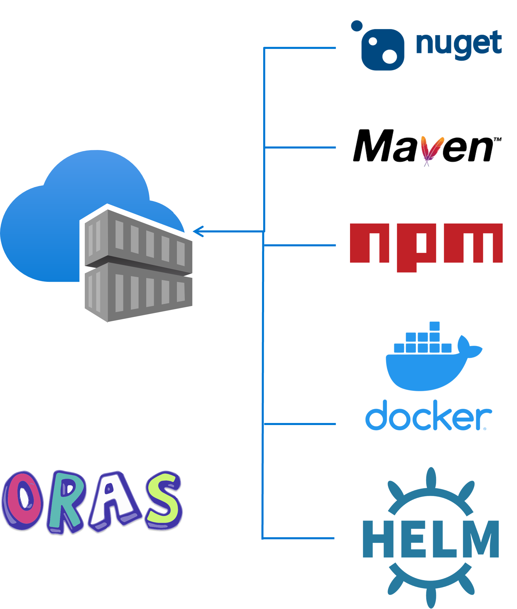

# Deploying application artifacts in ACR

## Introduction

This is how you can use ACR to deploy app packages like `nuget`, `npm`, `maven`, `docker` etc.

Azure container registry (ACR) helps you manage both the Open container initiative (OCI) artifacts and supply chain artifacts. This article guides you how to use ACR for managing OCI artifacts and supply chain artifacts effectively. Learn to store, manage, and retrieve both OCI artifacts and a graph of supply chain artifacts, including signatures, software bill of materials (SBOM), security scan results, and other types.



Documentation: https://learn.microsoft.com/en-us/azure/container-registry/container-registry-manage-artifact
Oras project: https://oras.land/

## Lab

```sh
winget install oras --version 1.2.0

$RG="rg-acr-oci"
$ACR_NAME="acrociregistry13"
$REGISTRY="$ACR_NAME.azurecr.io"
$REPO="net-monitor"
$TAG="v1"
$IMAGE="$REGISTRY/${REPO}:$TAG"

az login
az group create -n $RG -l swedencentral
az acr create -n $ACR_NAME -g $RG --sku Standard
az acr login -n $REGISTRY --expose-token

$TOKEN=$(az acr login -n $REGISTRY --expose-token --output tsv --query accessToken)

# Sign in with ORAS

oras login $REGISTRY --username "00000000-0000-0000-0000-000000000000" --password $TOKEN
# Login Succeeded
# oras login $REGISTRY --username $USER_NAME --password $PASSWORD

# Push and Pull OCI Artifacts with ORAS

oras push $REGISTRY/samples/artifact:readme --artifact-type readme/example ./readme.md:application/markdown
# ✓ Uploaded  readme.md                                                                                                                                                         589/589  B 100.00%  635ms
#   └─ sha256:f132432a5cb35e8e34c9669cc4c72390ca93cfc24802882941cc82b5d05133bf
# ✓ Uploaded  application/vnd.oci.empty.v1+json                                                                                                                                     2/2  B 100.00%  490ms
#   └─ sha256:44136fa355b3678a1146ad16f7e8649e94fb4fc21fe77e8310c060f61caaff8a
# ✓ Uploaded  application/vnd.oci.image.manifest.v1+json                                                                                                                        550/550  B 100.00%  287ms
#   └─ sha256:370e076ad19b329536da11f27a7db4a34b7f367452f0b615e905525b122cc28b
# Pushed [registry] acrociregistry13.azurecr.io/samples/artifact:readme
# ArtifactType: readme/example
# Digest: sha256:370e076ad19b329536da11f27a7db4a34b7f367452f0b615e905525b122cc28b

# To view the manifest created as a result of oras push, use oras manifest fetch:

oras manifest fetch --pretty $REGISTRY/samples/artifact:readme
# {
#   "schemaVersion": 2,
#   "mediaType": "application/vnd.oci.image.manifest.v1+json",
#   "artifactType": "readme/example",
#   "config": {
#     "mediaType": "application/vnd.oci.empty.v1+json",
#     "digest": "sha256:44136fa355b3678a1146ad16f7e8649e94fb4fc21fe77e8310c060f61caaff8a",
#     "size": 2,
#     "data": "e30="
#   },
#   "layers": [
#     {
#       "mediaType": "application/markdown",
#       "digest": "sha256:f132432a5cb35e8e34c9669cc4c72390ca93cfc24802882941cc82b5d05133bf",
#       "size": 589,
#       "annotations": {
#         "org.opencontainers.image.title": "readme.md"
#       }
#     }
#   ],
#   "annotations": {
#     "org.opencontainers.image.created": "2024-10-24T10:18:02Z"
#   }
# }

# Pull an artifact

mkdir ./download

oras pull -o ./download $REGISTRY/samples/artifact:readme

# Remove the artifact (optional)

oras manifest delete $REGISTRY/samples/artifact:readme

# push a nuget package

oras push $REGISTRY/nuget/newtonsoft:13.0.3 --artifact-type package/nuget ./newtonsoft.json.13.0.3.nupkg
```