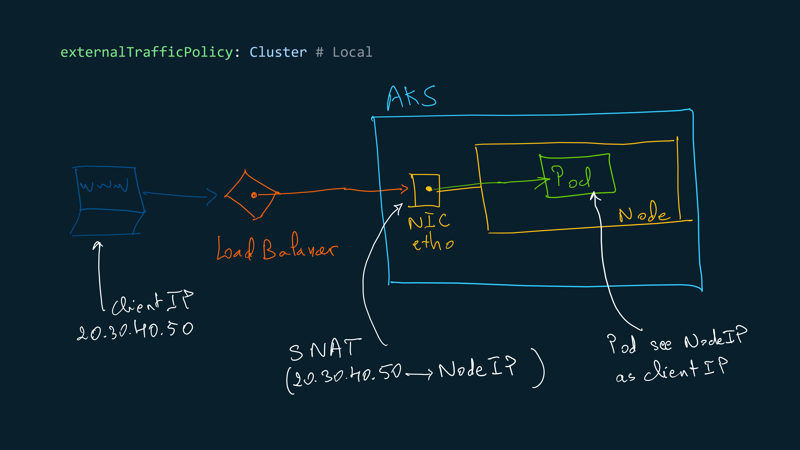

# Preserving the IP address of the client

## Introduction

In this section, you will learn how to preserve the IP address of the client when using an Ingress Controller. This is useful when you need to know the client's IP address in your application.
By deafault, the LoadBalancer service type uses the Azure Standard Load Balancer, which does not preserve the client's IP address. Instead, it replaces it with the IP address of the Load Balancer. To preserve the client's IP address, you need to apply the following spec to the Nginx Ingress Controller service:

```yaml
spec.externalTrafficPolicy: Local
```

This way the original IP address of the client will be carried by the headers: `X-Forwarded-For` and `X-Real-IP`.



Here is a step-by-step guide to demonstrate how to preserve the client's IP address.

```sh
# create an AKS cluster
$AKS_RG="rg-aks-cluster-570"
$AKS_NAME="aks-cluster"

az group create -n $AKS_RG -l swedencentral

az aks create -g $AKS_RG -n $AKS_NAME --network-plugin azure --network-plugin-mode overlay

az aks get-credentials -n $AKS_NAME -g $AKS_RG --overwrite-existing

# verify connection to the cluster
kubectl get nodes

# create and expose a service of type LoadBalancer

kubectl apply -f 1-deploy-svc.yaml

# check the app working, and get the public IP address of the service

kubectl get svc,deploy

# navigate to the public IP address in the browser
# check the IP address of the client in the request.
# It doesn't match the IP address of the client.
# It should be the IP address of the node/vm.
# It was SNAT'd by the VM.
# You can see the IP addresses of the node/vm and the LoadBalancer in the request.

kubectl get nodes -o wide

# now enable `externalTrafficPolicy: Local` in the public service

kubectl patch svc webapp -p '{\"spec\":{\"externalTrafficPolicy\":\"Local\"}}'

# if using Linux, use the following command instead
# kubectl patch svc webapp -p '{"spec":{"externalTrafficPolicy":"Local"}}'

# check the request. It should contain the original client IP address (Remote IP Address).

# What about the traffic coming through ingress controller?

# install Nginx ingress controller

helm repo add ingress-nginx https://kubernetes.github.io/ingress-nginx
helm repo update

$NAMESPACE_INGRESS="ingress-nginx"

helm install ingress-nginx ingress-nginx/ingress-nginx `
     --create-namespace `
     --namespace $NAMESPACE_INGRESS `
     --set controller.service.annotations."service\.beta\.kubernetes\.io/azure-load-balancer-health-probe-request-path"=/healthz `
     --set controller.service.annotations."service\.beta\.kubernetes\.io/azure-load-balancer-health-probe-port"=80 

kubectl get pods,deployments,services --namespace $NAMESPACE_INGRESS

$INGRESS_PUPLIC_IP=$(kubectl get services ingress-nginx-controller -n $NAMESPACE_INGRESS -o jsonpath='{.status.loadBalancer.ingress[0].ip}')
echo $INGRESS_PUPLIC_IP

kubectl apply -f 2-ingress-svc.yaml

# check the "X-Forwarded-For" header in the response. It should contain the SNAT'd IP address of the client, which become the IP address of the node/vm.

# Enable "externalTrafficPolicy: Local" in the ingress controller service

kubectl patch svc ingress-nginx-controller -n $NAMESPACE_INGRESS -p '{\"spec\":{\"externalTrafficPolicy\":\"Local\"}}'

# if using Linux, use the following command instead
# kubectl patch svc ingress-nginx-controller -n $NAMESPACE_INGRESS -p '{"spec":{"externalTrafficPolicy":"Local"}}'

# check the "X-Forwarded-For" and "X-Real-IP" headera in the response. They should contain the original client IP address.
```

## More resources and references

https://kubernetes.io/docs/tutorials/services/source-ip/
https://kubernetes.io/docs/tasks/access-application-cluster/create-external-load-balancer/#preserving-the-client-source-ip