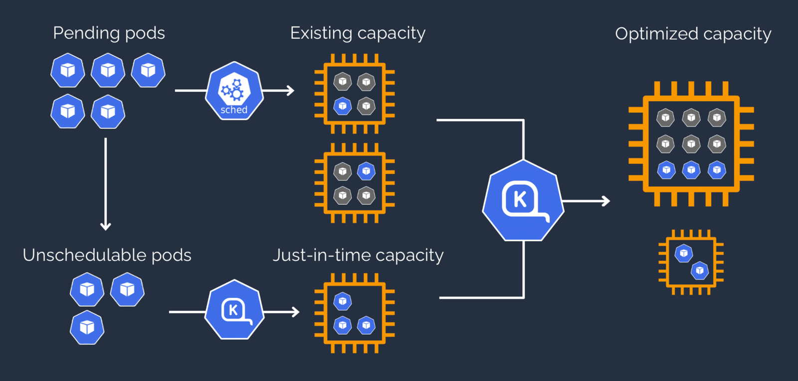

# Karpenter for AKS



```sh
$AKS_RG="rg-aks-cluster-karpenter"
$AKS_NAME="aks-cluster"

az group create -n $AKS_RG -l westeurope

# Create AKS with Karpenter enabled
az aks create -n $AKS_NAME -g $AKS_RG --node-provisioning-mode Auto --network-plugin azure --network-plugin-mode overlay --network-dataplane cilium

az aks get-credentials -n $AKS_NAME -g $AKS_RG

kubectl get nodes

# Check existing Pods, there is no pods for Karpenter

kubectl get pods -A

# Check Karpenter CRDs

kubectl get nodepool

kubectl describe nodepool default

kubectl get AKSNodeClass

kubectl describe AKSNodeClass default

# Deploy Karpenter custom Nodepool

kubectl apply -f nodepool-burstable.yaml

kubectl get nodepool

# Deploy sample Nginx deployment to trigger Karpenter autoprovisioning

kubectl create deployment nginx --image=nginx --replicas=1000

kubectl get deploy -w

# Watch for new VMs created by Karpenter

kubectl get nodes -w

# Check these VMs in Azure portal

# scaledown the deployment

kubectl scale deployment nginx --replicas=0

# watch for VMs deletion

kubectl get nodes -w
```